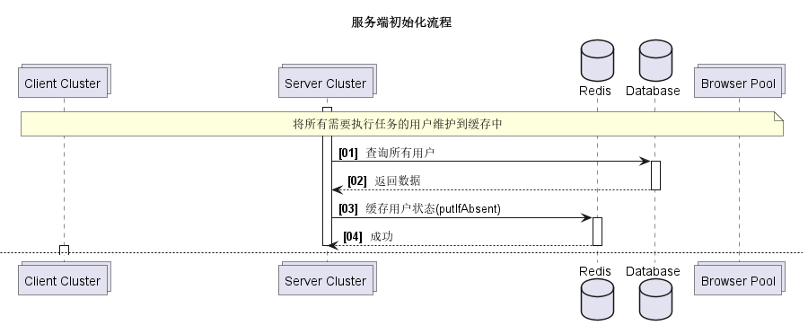
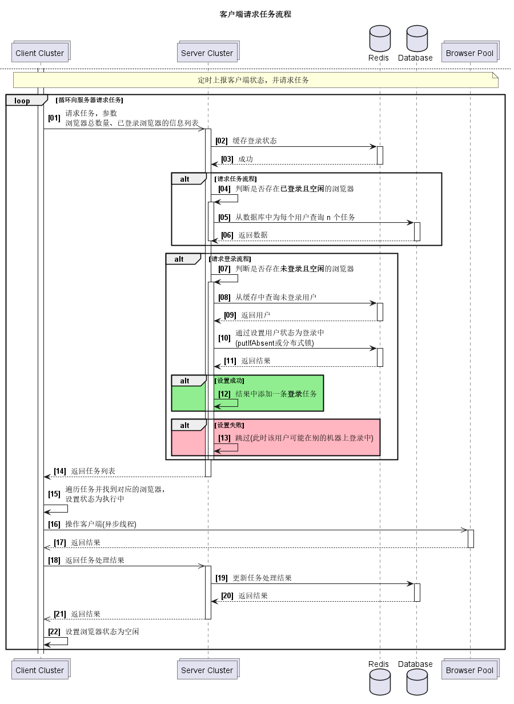
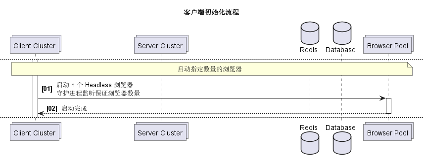

# RPA

## 技术选型

### 客户端

- Python
- [Selenium](https://github.com/SeleniumHQ/selenium)：社区活跃，API 强大，文档详细，有学习成本，支持 Docker 中运行 Headless Browser
- [DrissionPage](https://github.com/g1879/DrissionPage)：个人研发，API 易用，文档较少，上手简单，暂不支持 Docker 中运行

### 服务端

- Python：开发简单
- Java：团队擅长

## 设计方案

### 角色

#### Server

集群多实例，可以滚动发布，提供 HTTP API 或 TCP 或 WebSocket Endpoint。

1. HTTP：
    - 优点：
        - 无状态
        - 开发联调简单
        - 滚动发布不影响客户端
    - 缺点：
        - 服务端无法主动推送消息
        - 相较于长连接性能较差
2. TCP：
    - 优点：
        - 报文小性能好
        - 服务端可以主动推送消息
        - 客户端断连有事件，可以感知是否存活
    - 缺点：
        - 有状态
        - 开发联调难
        - 重新部署会导致客户端断连
        - 需要处理消息流，额外开发工作量
3. Websocket：
    - 优点：
        - 支持 Nginx 反代和负载均衡，
        - 服务端可以主动推送消息
        - 客户端断连有事件，可以感知是否存活
        - 基于消息包，不需要处理消息边界，有现成框架
    - 缺点：
        - 有状态
        - 开发联调难
        - 重新部署会导致客户端断连

_使用长连接服务端可以主动向客户端推送消息，如：更新了任务流程脚本，调整客户端浏览器数量等，
使用 HTTP 只能定时查询相关配置。_

#### Client

集群多实例，每个实例维护多个浏览器。

1. 保持登录状态的客户端：用户登录至该浏览器后，要保持登录状态，所以维护到共享内存中（Redis），后续该用户的任务只能通过当前浏览器执行。
    - 优点：
        - 减少登录次数，任务效率高
        - 同一个用户的任务只会被串行执行，每一个任务天然线程安全
    - 缺点：
        - 需要维护登录状态到共享内存，有运维成本
        - 当某个用户任务比较多时，可能会堆积任务，无法充分发挥多线程多进程性能
2. 不保持登录状态的无状态客户端：用户每次执行任务前都会先进行登录操作，但任务执行完成后，则视当前浏览器为无登录，不需要维护登录维护
    - 优点：
        - 不需要维护登录状态到共享内存
        - 出现莫名其妙 BUG 的概率较低
        - 充分发挥多线程多进程性能
    - 缺点：
        - 每次都需要登录，影响实际任务执行效率
        - 不支持多设备登录互踢的用户体系
        - 需要分布式锁保证竞态下同一个任务不会被执行多次，如：`redis.setnx(task_id, 1)`
3. 支持多地登录客户端：用户在多个设备登录，相互之间不会互踢，单个用户的任务可以并行处理，本地短时间持有登录状态，过期后主动释放
    - 优点：
        - 减少登录次数，任务效率高
        - 不需要维护登录状态到共享内存，本地记录即可
        - 充分发挥多线程多进程性能
    - 缺点：
        - 需要分布式锁保证竞态下同一个任务不会被执行多次，如：`redis.setnx(task_id, 1)`

只支持单设备登录只能选择方案1，支持多设备登录可以选择方案2和3。

#### Headless Browser

生命周期由 Client 维护，如果浏览器崩溃，Client 守护进程会重启。

### 有状态流程

客户端维护了本地所有浏览器以及登录状态，然后将本地信息上报到服务端，并轮询向服务端请求任务。

如过用户在缓存中状态是已登录，但是超过指定时间没有更新，则标记为不健康，可能是浏览器崩溃或服务端崩溃；

加入告警系统。





### 无状态流程





## 问题

### 更新脚本免重启

- 实现脚本解释器。
- 脚本版本号及下发逻辑。

## Demo

### 客户端 Demo

文档：[README.md](client/README.md)


### 服务端 Demo

文档：[README.md](server/README.md)

```json
[
  {
    "name": "草莓",
    "image": "https://iconfont.alicdn.com/p/illus/preview_image/gYYV4kVWQGQf/1398c296-0412-41ac-833c-e11aabc56ede.png"
  },
  {
    "name": "草莓心",
    "image": "https://iconfont.alicdn.com/p/illus/preview_image/14AqUM6JISA9/a8e4e849-07d6-40b9-baa0-aa11e043c204.png"
  },
  {
    "name": "草莓牛奶",
    "image": "https://iconfont.alicdn.com/p/illus/preview_image/f394aMHemBif/8e38c694-6499-4e2a-80c5-a3d23fc0b28e.png"
  },
  {
    "name": "草莓+柠檬",
    "image": "https://iconfont.alicdn.com/p/illus/preview_image/ZIy3vE7z7BNr/2df4f2cd-fc68-42a3-b7f6-23bc42230307.png"
  },
  {
    "name": "草莓蛋糕",
    "image": "https://iconfont.alicdn.com/p/illus/preview_image/19kRktHMRtij/65cbdb14-3758-4b59-bded-d2f10181a06e.png"
  },
  {
    "name": "草莓酸奶",
    "image": "https://iconfont.alicdn.com/p/illus/preview_image/f394aMHemBif/cb57b7d0-8111-4c63-b198-7ec851d92d47.png"
  },
  {
    "name": "草莓奶油",
    "image": "https://iconfont.alicdn.com/p/illus/preview_image/aauDzSruAvaF/9c709448-27a1-4001-9832-e237bc7a2054.png"
  },
  {
    "name": "草莓麻薯猫",
    "image": "https://iconfont.alicdn.com/p/illus/preview_image/9L2cqSN75nrX/43bebb43-3ba5-497c-931a-b8a4ed56b321.png"
  },
  {
    "name": "草莓麻薯奶茶",
    "image": "https://iconfont.alicdn.com/p/illus/preview_image/9L2cqSN75nrX/cd999c3c-749d-4d5e-a10c-c1408f8c1d8b.png"
  },
  {
    "name": "草莓纸杯蛋糕",
    "image": "https://iconfont.alicdn.com/p/illus/preview_image/fP5NfcBjjkAl/98ffc4b5-ebb0-457a-b558-01253944c4f2.png"
  }
]
```